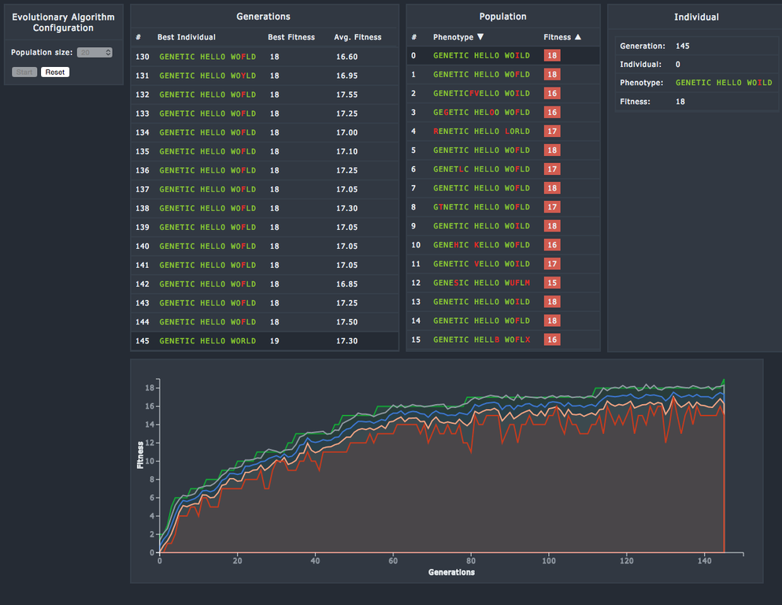

darwin.js
=========

A JavaScript framework for Evolutionary Algorithms.

This framework is work in progress. The goal is to provide a general framework for the following type of
evolutionary algorithms:

- Genetic Algorithm
- Genetic Programming
- Evolution Strategies - Support for both (μ + λ) and (μ, λ) evolution strategies.

Example
=======

[String Evolver](https://rawgit.com/davidrobles/darwin.js/master/examples/string-evolver/index.html)

Callbacks
=========

| Callback                   | Description
| -------------------------- | -----------
| ea-started                 | Fires once, when the EA starts
| generation-started         | Fires when a new generation starts
| population-generated       | Fires when the population generated on every generation
| population-evaluated       | Fires when the population is evaluated at the beginning of a generation
| generation-finished        | Fires when a new generation ends
| ea-finished                | Fires once, when the EA ends
| reset                      | Fires when the EA is reset
